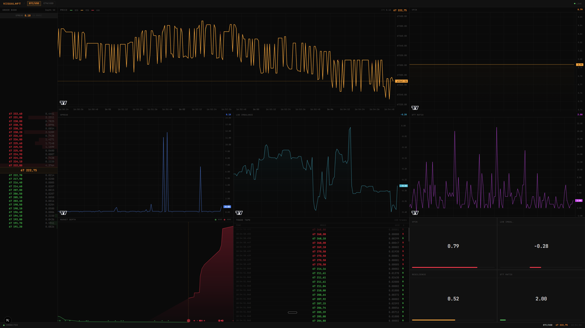

# VisualHFT

Real-time market microstructure dashboard. Streams live order book data from crypto exchanges and computes institutional-grade analytics (VPIN, LOB Imbalance, Market Resilience, OTT Ratio) in real-time.

Built on top of [silahian's VisualHFT](https://github.com/silahian/VisualHFT) (Apache 2.0). The original C# engine handles exchange connectivity, order book reconstruction, and study computations. This fork adds a headless WebSocket server and a Next.js web dashboard.



## What It Shows

- **Order Book.** Full bid/ask depth ladder with 15 levels per side and relative size bars.
- **Price Chart.** Bid, mid, and ask price over time. Three separate lines so you can see spread dynamics.
- **VPIN.** Volume-Synchronized Probability of Informed Trading. Ranges 0 to 1. Spikes when informed traders are active.
- **LOB Imbalance.** Bid vs ask volume ratio. Positive = buyers dominating, negative = sellers.
- **Spread.** Bid-ask spread over time. Widening = liquidity drying up.
- **OTT Ratio.** Order-to-Trade ratio. High values = lots of order activity but few executions.
- **Market Depth.** Cumulative depth on each side of the book.
- **Trade Tape.** Every executed trade, color-coded buy/sell, with millisecond timestamps.
- **Market Resilience.** How fast the order book recovers after a trade.

## Architecture

```
Binance WebSocket (public, no auth)
  → C# Market Connector Plugin
  → HelperOrderBook / HelperTrade (event bus)
  → Study Plugins (VPIN, LOB Imbalance, Resilience, OTT)
  → WebSocket Server (port 5000, JSON broadcast)
  → Next.js Dashboard (port 3000, real-time render)
```

**C# Backend (`VisualHFT.WebServer`):** Headless ASP.NET Core server that loads the same plugins as the original WPF app using reflection. Subscribes to the internal event bus, converts data to JSON DTOs, and broadcasts over WebSocket. Order book updates throttled to 10Hz.

**Next.js Frontend (`visualhft-ui`):** Connects to `ws://localhost:5000/ws`. Central state managed with `useReducer`. Nine visualization components. TradingView lightweight-charts for time series. Canvas rendering for depth chart. Auto-discovers symbols from the data stream.

## Prerequisites

- .NET 8 SDK
- Node.js 18+

No API keys. No environment variables. No config files. No accounts.

## Quick Start

**Terminal 1: C# Backend**

```bash
dotnet build VisualHFT.sln
dotnet run --project VisualHFT.WebServer
```

**Terminal 2: Next.js Frontend**

```bash
cd visualhft-ui
npm install
npm run dev
```

Open `http://localhost:3000`. Live data starts streaming immediately.

## Supported Exchanges

Binance, Coinbase, Kraken, KuCoin, Bitfinex, BitStamp, Gemini, and a generic WebSocket connector. Binance is the default. All use public market data feeds (no API key required for market data).

## Credits

The C# backend, plugin architecture, exchange connectors, and study implementations are built by [silahian](https://github.com/silahian/VisualHFT). Original project licensed under Apache 2.0.

This fork adds:
- `VisualHFT.WebServer` (headless WebSocket bridge)
- `visualhft-ui` (Next.js real-time dashboard)

## License

Apache 2.0. See [LICENSE](LICENSE.txt) and [NOTICE](NOTICE).
